# TrailGuide AI — Complete Project Guide

This document is a deep dive into the TrailGuide AI repository. It describes the architecture, file structure, runtime behavior, key flows, deployment configuration, and implementation details across the frontend, backend, AI microservice, and database.

> If you only need a quick summary, see `docs/project-overview.md`. This guide is intended for developers who want a complete understanding of the codebase.

---

## Table of Contents

1. [Project Summary](#project-summary)
2. [High-Level Architecture](#high-level-architecture)
3. [Key Repositories and Services](#key-repositories-and-services)
4. [Frontend Structure](#frontend-structure)
   - [App Router and Route Groups](#app-router-and-route-groups)
   - [Core UI Components](#core-ui-components)
   - [Client Libraries and Helpers](#client-libraries-and-helpers)
5. [Backend API Structure](#backend-api-structure)
   - [Entry Point and Server Setup](#entry-point-and-server-setup)
   - [Route Handlers and Proxying](#route-handlers-and-proxying)
   - [Auth and Middleware](#auth-and-middleware)
   - [Database Integration](#database-integration)
6. [AI Microservice Architecture](#ai-microservice-architecture)
   - [FastAPI Routers](#fastapi-routers)
   - [Groq Integration](#groq-integration)
   - [AI Endpoints and Prompts](#ai-endpoints-and-prompts)
7. [Database Schema and Migrations](#database-schema-and-migrations)
8. [Supabase and Auth Patterns](#supabase-and-auth-patterns)
9. [Feature Deep Dives](#feature-deep-dives)
   - [Trip Planning and Itinerary Generation](#trip-planning-and-itinerary-generation)
   - [Explore / Recommendations](#explore--recommendations)
   - [Photos and Media](#photos-and-media)
   - [Telegram Integration](#telegram-integration)
   - [Document Import](#document-import)
   - [Weather and Companion Features](#weather-and-companion-features)
10. [Environment Variables and Configuration](#environment-variables-and-configuration)
11. [Local Development Workflow](#local-development-workflow)
12. [Deployment Notes](#deployment-notes)
13. [Security and Best Practices](#security-and-best-practices)
14. [Troubleshooting](#troubleshooting)
15. [Future Improvements and Extensions](#future-improvements-and-extensions)

---

## Project Summary

TrailGuide AI is a travel planning application built with:

- **Frontend:** Next.js 16.2.9, React 19, TypeScript, Tailwind CSS v4
- **Backend API:** Go with `gin-gonic`, serving authenticated routes and proxying AI requests
- **AI Service:** Python FastAPI app using Groq SDK for model calls
- **Database:** Supabase PostgreSQL with migrations and RLS policies
- **Deployments:** Vercel for frontend/API, Docker for local service composition

The application helps users create travel plans, generate AI itineraries, discover local recommendations, retrieve photos, import travel documents, and receive notifications through Telegram.

---

## High-Level Architecture

The main architectural components are:

- **Frontend UI:** built in `src/`, with route groups for authenticated app pages, public trip sharing, and auth.
- **Backend API:** located in `backend/`, handling trip CRUD, authentication, CORS, and AI proxy routes.
- **AI Microservice:** located in `ai-service/`, providing specialised AI-driven endpoints for itinerary generation, chat, recommendations, story writing, document parsing, and photos.
- **Database:** managed by Supabase with schema migrations in `supabase/migrations/`.
- **Docs:** repository documentation lives in `docs/`.



### Architecture Summary

- The frontend communicates with Supabase and the backend.
- The backend connects to Supabase for trip CRUD and proxies AI calls to the Python AI service.
- The AI service calls Groq to generate responses.
- Photo requests are proxied through the AI service from Wikipedia and Unsplash.
- Telegram and public share flows use the service role Supabase client for trusted server-side operations.

---

## Key Repositories and Services

This repository combines three main runtimes:

1. **Next.js Frontend** (`src/`): the main web app, Auth pages, and API edge routes.
2. **Go Backend** (`backend/`): an API server for requests that need trusted access, proxying, or dedicated infrastructure.
3. **Python AI Service** (`ai-service/`): a FastAPI application that handles AI prompts and external API orchestration.

### `package.json`

The project uses standard Next.js scripts:

- `npm run dev` — starts the local frontend dev server
- `npm run build` — builds the app for production
- `npm run start` — starts the production server
- `npm run lint` — runs ESLint

The frontend dependencies include Supabase, Groq SDK, Tailwind, Leaflet, Telegram support, and utilities for PDF and image export.

---

## Frontend Structure

### App Router and Route Groups

The frontend uses the Next.js App Router. The route folders are:

- `src/app/(app)/` — authenticated user experience
- `src/app/(auth)/` — login, signup, and callback pages
- `src/app/api/` — serverless API routes for AI, Telegram, documents, weather, and photos
- `src/app/share/[tripId]/` — public trip viewer

#### Core route groups

- `dashboard/` — user trip list and quick actions
- `trips/new/` — the trip creation wizard
- `trips/[id]/` — trip detail pages and nested tabs
- `explore/` — discover recommendations and local destinations
- `settings/` — account settings, Telegram linking, and profile
- `summary/` — post-trip highlights and story

### Core UI Components

The main component folders in `src/components/` are:

- `calendar/` — calendar views and date selection UI
- `discover/` — recommendation cards and discovery flows
- `documents/` — imported document previews and uploads
- `expenses/` — budgeting and cost tracking elements
- `itinerary/` — activity cards, day layouts, and schedule controls
- `maps/` — Leaflet map integration and place pin components
- `packing/` — packing list UI and checkboxes
- `photos/` — image cards and gallery views
- `summary/` — summary cards and printable exports
- `trip/` — trip overview panels and progress states
- `ui/` — shared buttons, inputs, modals, and notifications

### Client Libraries and Helpers

The `src/lib/` folder contains frontend helpers and API wrappers.

#### `src/lib/ai.ts`

This file defines `GeminiService`, a wrapper around Groq chat and itinerary generation. It contains:

- travel planning prompts for collecting trip config
- itinerary generation prompts with required JSON schema
- edit and replacement helpers for itinerary modifications
- context enrichment via web search using Tavily

It standardises request shapes, sanitises AI responses, and ensures strict JSON output.

#### `src/lib/backend-proxy.ts`

This helper forwards requests from the frontend to the Go backend when `BACKEND_URL` is configured.

It is used for AI routes when the backend is available, giving the app a flexible deployment mode:

- direct AI calls when backend is absent
- backend proxied AI calls when backend is present

The proxy sets a 55-second abort timeout to match serverless limits.

#### `src/lib/supabase/server.ts`

This file exports two Supabase client helpers:

- `createClient()` — reads cookies and acts as a session-based user client with RLS
- `createServiceClient()` — uses the Supabase service role key for trusted server-side access

The app uses `createServiceClient()` only in contexts where the backend is trusted, such as Telegram webhooks and public share rendering.

---

## Backend API Structure

The Go backend is a lightweight API server with the following responsibilities:

- Proxy AI routes to the Python AI service
- Serve secure `/api/v1/*` endpoints with Supabase JWT auth
- Manage trips CRUD directly against the Postgres database
- Provide a health endpoint

### Entry Point and Server Setup

File: `backend/main.go`

This file:

- loads environment variables via `godotenv`
- loads configuration from `backend/config/config.go`
- connects to Postgres using `backend/db/db.go`
- sets up CORS headers
- registers routes and middleware
- listens on the configured port

CORS is configurable via `CORS_ALLOW_ORIGIN` and defaults to `*` for local development.

### Route Handlers and Proxying

Files in `backend/handlers/`:

- `trips.go` — trip CRUD operations
- `ai_proxy.go` — forwards `/api/v1/ai/*`, `/api/v1/documents/*`, `/api/v1/places/*`, and `/api/v1/weather` to the Python AI service
- `health.go` — simple health check endpoint

#### Trip CRUD

`handlers/trips.go` defines a `TripsHandler` with methods:

- `List` — returns trips for the authenticated user
- `Get` — returns a single trip by ID
- `Create` — inserts a new trip row
- `Update` — patches a trip row
- `Delete` — soft-deletes the trip by row removal

The trip model includes fields such as:

- `id`, `user_id`, `title`, `destination`
- `start_date`, `end_date`, `status`
- audit timestamps (`created_at`, `updated_at`)

Validation is enforced on string lengths and status values.

#### AI Proxy

`handlers/ai_proxy.go` builds upstream requests and forwards headers, body, and response data.

It also adds an `X-Internal-Token` header to authenticate the Python service.

By design, the backend never interprets AI responses; it only forwards traffic.

### Auth and Middleware

`backend/middleware/auth.go` provides middleware that validates Supabase JWTs.

It extracts the user ID from the token and attaches it to request context so handlers can enforce ownership.

This middleware is used for the `/api/v1` route group.

### Database Integration

`backend/db/db.go` creates a Postgres connection pool with `pgxpool`.

It validates connectivity on startup and logs a successful connection.

The backend uses the `DATABASE_URL` environment variable and requires it to be present.

### Configuration

`backend/config/config.go` defines the configuration object:

- `PORT`
- `DATABASE_URL`
- `SUPABASE_JWT_SECRET`
- `AI_SERVICE_URL`
- `INTERNAL_API_SECRET`
- `TELEGRAM_BOT_TOKEN`
- `CORS_ALLOW_ORIGIN`

`mustEnv()` fails fast if required values are missing.

---

## AI Microservice Architecture

The AI microservice is a Python FastAPI app located in `ai-service/`.

It handles endpoints that require AI generation, photo proxying, document parsing, and weather.

### FastAPI Routers

Routers are defined in `ai-service/routers/`:

- `chat.py` — interactive AI conversation
- `generate.py` — itinerary generation
- `recommendations.py` — suggestions for the discover tab
- `replace.py` — activity replacement
- `preview_replace.py` — preview replacement before committing
- `story.py` — travel story generation
- `edit.py` — itinerary edits
- `import_doc.py` — document import and extraction
- `photos.py` — Wikipedia and Unsplash photo proxy
- `weather.py` — weather requests

The main app file `ai-service/main.py` registers all routers and exposes a `/health` endpoint.

### Auth Middleware

`ai-service/middleware/auth.py` verifies that incoming requests carry a valid `X-Internal-Token` header.

This token is compared to `INTERNAL_API_SECRET`, preventing public access to internal AI endpoints.

### Groq Integration

`ai-service/services/groq_client.py` lazily initialises a Groq client using `GROQ_API_KEY`.

All AI logic uses this client to call Groq chat completions.

### AI Endpoint Details

#### `generate.py`

This router exposes `POST /ai/generate-itinerary`.

It expects structured trip data and builds a prompt requiring strict JSON output.

The prompt includes:

- destination
- dates
- number of travelers
- travel style
- interests
- transport mode
- budget
- optional flight/hotel info
- currency

The model is instructed explicitly not to return markdown or explanation, only JSON.

If the AI returns fenced code blocks, the handler strips them and parses the raw JSON.

If the JSON parse fails, the endpoint returns `502 Bad Gateway`.

#### `photos.py`

This router exposes `GET /places/photo?query=...`.

The service first attempts Wikipedia page image extraction.

If Wikipedia yields a safe image, it proxies the bytes back with `Access-Control-Allow-Origin: *`.

If no Wikipedia image is available and `UNSPLASH_ACCESS_KEY` exists, it falls back to Unsplash.

Safe host validation is enforced for image URLs.

#### `middleware/routers/*`

Each router is protected by `verify_internal_token`, so only authorised backend traffic can reach AI endpoints.

This provides a strong separation between public frontend routes and internal AI services.

---

## Database Schema and Migrations

All database migrations live in `supabase/migrations/`.

The schema evolves through files such as:

- `001_initial_schema.sql`
- `002_phase4_columns.sql`
- `003_expenses.sql`
- `004_checklist.sql`
- `005_public_trips.sql`
- `006_activity_photos.sql`
- `007_culture_currency_cache.sql`

### Schema highlights

The application uses tables for:

- `profiles`
- `trips`
- `days` / `itinerary_days`
- `activities`
- `expenses`
- `checklist` or packing list items
- `public_trips`
- `activity_photos`
- cached culture / currency data

### Supabase policies

RLS policies are used everywhere.

Authenticated users can only access rows where `auth.uid() = user_id`.

Public share pages and Telegram webhooks rely on a service role client to bypass RLS for trusted reads.

---

## Supabase and Auth Patterns

The project uses Supabase for:

- authentication
- user profiles
- database access
- real-time sync (potentially)

### Client types

Three Supabase client patterns exist:

- `createClient()` — server-side authenticated user client
- `createServiceClient()` — service role client for trusted server-side logic
- `browser client` — likely used in client-side UI code for auth flows

### Auth flow

The user authentication flow is:

1. user visits login / signup
2. Supabase Auth handles email link or OAuth
3. session cookies are stored by Supabase
4. `createClient()` reads cookies in server components and API routes
5. user is redirected to the authenticated app area

### Telegram account linking

The app stores Telegram Chat IDs in `profiles.telegram_chat_id`.

The linking flow is simple:

1. user sends `/start` in the bot
2. bot returns the chat ID
3. user pastes the chat ID into the app
4. app saves the chat ID to `profiles`

Once linked, the bot can look up the profile and return trip info.

---

## Feature Deep Dives

### Trip Planning and Itinerary Generation

#### Wizard and trip creation

The trip creation wizard runs under `src/app/(app)/trips/new/`.

It likely prompts the user for:

- destination
- dates
- number of travelers
- travel style
- interests
- transport mode
- budget
- optional flight/hotel details

The frontend collects these values and submits them to `POST /api/ai/generate-itinerary`.

#### Itinerary generation

The AI service generates structured itinerary JSON with:

- days array
- activities array for each day
- fields such as title, description, time, duration, cost, category, address, and photo query

It is important that the AI returns valid JSON because the frontend consumes the object directly.

If the backend proxy is configured, the request can go through the Go backend as `POST /api/v1/ai/generate-itinerary`.

The Go backend forwards the request to the Python service and returns the response unchanged.

#### Itinerary editing and replacement

The app supports updates such as:

- editing activity details
- replacing a single activity
- previewing replacements before commit

Routes include:

- `POST /api/ai/edit-itinerary`
- `POST /api/ai/replace-activity`
- `POST /api/ai/preview-replace`

These endpoints use prompts tailored to JSON output and maintain activity scheduling context.

### Explore / Recommendations

The Discover tab likely calls `POST /api/ai/recommendations`.

This endpoint generates nearby suggestions based on current trip context and interest tags.

Recommendations may be produced with a smaller, faster model and do not require a full itinerary regeneration.

### Photos and Media

Photo fetching is handled by the AI service via `GET /places/photo`.

Key points:

- Wikipedia is the primary source for place images
- Unsplash is optional fallback when Wikipedia images are unavailable
- The service proxies bytes instead of redirecting, which avoids CORS issues in browser image captures
- Response headers include caching and cross-origin allowances

### Telegram Integration

Telegram integration lives under `src/app/api/telegram/` and in the docs `docs/telegram-bot.md`.

Key routes:

- `POST /api/telegram/link` — save Chat ID to profile
- `POST /api/telegram/webhook` — receive updates from Telegram

The webhook endpoint verifies the optional `x-telegram-bot-api-secret-token` when configured.

The bot supports commands:

- `/start`
- `/trip`
- `/next`
- `/status`

It uses `createServiceClient()` so it can query protected data outside a user session.

### Document Import

The app also supports travel document import.

This feature likely lives in:

- `src/app/api/documents/import/`
- `ai-service/routers/import_doc.py`

It accepts raw document text or PDF content and extracts booking details for flights, hotels, or confirmation numbers.

### Weather and Companion Features

Weather is provided by `ai-service/routers/weather.py` and likely proxied through `backend/main.go`.

The companion view uses weather, current activity status, and upcoming notifications to guide the user in real time.

---

## Environment Variables and Configuration

Environment variables are documented in `docs/env-vars.md`.

### Required local values

- `NEXT_PUBLIC_SUPABASE_URL`
- `NEXT_PUBLIC_SUPABASE_ANON_KEY`
- `SUPABASE_SERVICE_ROLE_KEY`
- `GROQ_API_KEY`
- `TAVILY_API_KEY`

### Optional values

- `UNSPLASH_ACCESS_KEY`
- `TELEGRAM_BOT_TOKEN`
- `NEXT_PUBLIC_SITE_URL`
- `RESEND_API_KEY`
- `CRON_SECRET`

### Backend service values

For the Go backend, the important values are:

- `DATABASE_URL`
- `SUPABASE_JWT_SECRET`
- `AI_SERVICE_URL`
- `INTERNAL_API_SECRET`
- `CORS_ALLOW_ORIGIN`

The AI service needs `GROQ_API_KEY` and `INTERNAL_API_SECRET`.

---

## Local Development Workflow

### Prerequisites

- Node.js 18+ and npm
- Supabase project
- Groq API key
- Tavily API key
- Optional: Unsplash key, Telegram bot token

### Setup steps

1. Clone the repo
2. Install node dependencies with `npm install`
3. Copy `.env.local.example` to `.env.local`
4. Add required environment variables
5. Run Supabase migrations from `supabase/migrations/`
6. Start the dev server with `npm run dev`

### Optional local AI and backend

The project supports a standalone backend and AI service in Docker, but the frontend can also call Groq directly.

For local AI service debugging, run the FastAPI app from `ai-service/`.

### Telegram local testing

Use `node scripts/telegram-poll.mjs` to forward Telegram updates to localhost.

---

## Deployment Notes

The typical production architecture includes:

- Vercel for Next.js frontend and edge API routes
- Supabase for auth and Postgres database
- Groq hosted AI model
- Optional Docker deployment for the Python AI service, if not using direct Groq calls from the frontend

### Vercel

- Add all required environment variables in the Vercel dashboard
- Set `NEXT_PUBLIC_SITE_URL` to your production domain
- Configure Supabase redirect URLs for authentication

### Telegram webhook

Register the webhook once after deployment:

```bash
curl "https://api.telegram.org/bot<YOUR_TOKEN>/setWebhook?url=https://<your-app>/api/telegram/webhook&secret_token=<TELEGRAM_WEBHOOK_SECRET>"

---

## Markdown files in this repository

The following files are the main Markdown documentation in this project.

- `AGENTS.md` — agent instructions and tool integration rules for the repo.
- `CHANGELOG.md` — release status and project changelog.
- `CLAUDE.md` — references Claude / AI agent docs.
- `README.md` — main project landing page and quickstart.
- `SUDO_COMMANDS.md` — shortcut commands for setup or recovery.
- `docs/api-reference.md` — detailed API route reference.
- `docs/architecture.md` — architecture and schema documentation.
- `docs/env-vars.md` — required and optional environment variables.
- `docs/project-guide.md` — complete long-form project guide.
- `docs/project-overview.md` — short project summary and diagrams.
- `docs/telegram-bot.md` — Telegram bot setup and command guide.
- `docs/superpowers/plans/2026-06-16-phase1-foundation.md` — phase 1 foundation plan.
- `docs/superpowers/plans/2026-06-17-phase6-deploy.md` — deployment implementation plan.
- `docs/superpowers/plans/2026-06-17-phase7-notifications.md` — notifications and lifecycle plan.
- `docs/superpowers/plans/2026-06-17-phase8-budget.md` — budget and expenses plan.
- `docs/superpowers/plans/2026-06-17-phase9-packing.md` — packing and pre-trip prep plan.
- `docs/superpowers/plans/2026-06-17-phase10-social.md` — social and trip templates plan.
- `docs/superpowers/plans/2026-06-17-phase11-documentation.md` — documentation plan.
- `docs/superpowers/plans/2026-06-18-phase12-security.md` — security hardening plan.
- `docs/superpowers/plans/2026-06-18-phase13-ratelimiting.md` — rate limiting plan.
- `docs/superpowers/plans/2026-06-18-phase14-pwa.md` — PWA and offline plan.
- `docs/superpowers/plans/2026-06-18-phase15-export.md` — export and calendar integration plan.
- `docs/superpowers/plans/2026-06-18-phase16-go-backend.md` — Go backend plan.
- `docs/superpowers/plans/2026-06-18-phase17-python-ai.md` — Python AI service plan.
- `docs/superpowers/plans/2026-06-18-phase18-frontend-migration.md` — frontend migration plan.
- `docs/superpowers/plans/2026-06-18-phase19-infrastructure.md` — infrastructure and deployment plan.
- `docs/superpowers/plans/2026-06-18-phase20-collaboration.md` — collaboration plan.
- `docs/superpowers/plans/2026-06-18-phase21-photo-journal.md` — photo journal plan.
- `docs/superpowers/plans/2026-06-18-phase22-flight-tracker.md` — flight tracker plan.
- `docs/superpowers/plans/2026-06-18-phase23-culture-toolkit.md` — culture toolkit plan.
- `docs/superpowers/plans/2026-06-18-phase24-destination-discovery.md` — destination discovery plan.
- `docs/superpowers/plans/2026-06-18-phase25-monitoring.md` — monitoring and admin plan.
- `docs/superpowers/plans/2026-06-18-phase26-agent-friendly-codebase.md` — agent-friendly codebase plan.
- `docs/superpowers/plans/2026-06-18-phase27-typescript-strict.md` — TypeScript strict mode plan.
- `docs/superpowers/plans/2026-06-18-phase28-go-tests.md` — Go backend test suite plan.
- `docs/superpowers/plans/2026-06-18-phase29-python-tests.md` — Python AI test suite plan.
- `docs/superpowers/plans/2026-06-18-phase30-e2e-tests.md` — end-to-end test plan.
- `docs/superpowers/plans/2026-06-18-phase31-structured-logging.md` — structured logging plan.
- `docs/superpowers/plans/2026-06-18-phase32-openapi.md` — OpenAPI spec plan.
- `docs/superpowers/plans/2026-06-18-phase33-local-dev.md` — local dev experience plan.
- `docs/superpowers/plans/2026-06-18-phase34-code-quality.md` — code quality automation plan.
- `docs/superpowers/plans/2026-06-18-phase35-debug-audit.md` — debug and production readiness plan.
- `docs/superpowers/plans/2026-06-18-phase36-budget-tracker.md` — budget tracker plan.
- `docs/superpowers/plans/2026-06-18-phase37-packing-list.md` — AI packing list plan.
- `docs/superpowers/plans/2026-06-18-phase38-smart-notifications.md` — smart notifications plan.
- `docs/superpowers/plans/2026-06-18-phase39-trip-templates.md` — trip templates plan.
- `docs/superpowers/plans/2026-06-18-phase40-onboarding.md` — onboarding redesign plan.
- `docs/superpowers/plans/2026-06-18-phase41-dark-mode.md` — dark mode plan.
- `docs/superpowers/plans/2026-06-18-phase42-voice-input.md` — voice input plan.
- `docs/superpowers/plans/2026-06-18-phase43-advanced-search.md` — advanced search plan.
- `docs/superpowers/plans/2026-06-18-phase44-i18n.md` — multi-language UI plan.
- `docs/superpowers/plans/2026-06-18-phase45-booking-links.md` — booking links plan.
- `docs/superpowers/plans/2026-06-18-phase46-weather-intelligence.md` — weather intelligence plan.
- `docs/superpowers/plans/2026-06-18-phase47-accessibility.md` — accessibility plan.
- `docs/superpowers/plans/2026-06-18-phase48-premium.md` — premium features plan.
- `docs/superpowers/plans/2026-06-18-phase49-analytics.md` — analytics plan.
- `docs/superpowers/plans/2026-06-18-phase50-social-sharing.md` — social sharing plan.
- `docs/superpowers/plans/2026-06-18-phase51-mobile-foundation.md` — mobile foundation plan.
- `docs/superpowers/plans/2026-06-18-phase52-mobile-auth.md` — mobile authentication plan.
- `docs/superpowers/plans/2026-06-18-phase53-mobile-navigation.md` — mobile navigation plan.
- `docs/superpowers/plans/2026-06-18-phase54-mobile-trips.md` — mobile trip list plan.
- `docs/superpowers/plans/2026-06-18-phase55-mobile-timeline.md` — mobile timeline plan.
- `docs/superpowers/plans/2026-06-18-phase56-mobile-map.md` — mobile map view plan.
- `docs/superpowers/plans/2026-06-18-phase57-mobile-ai-chat.md` — mobile AI chat companion plan.
- `docs/superpowers/plans/2026-06-18-phase58-60-mobile-features.md` — mobile discovery and photo journal plan.
- `docs/superpowers/plans/2026-06-18-phase61-80-mobile-roadmap.md` — mobile completion roadmap.
- `docs/superpowers/specs/2026-06-16-trailguide-ai-design.md` — design specification.

---
```

---

## Security and Best Practices

### Token handling

- `SUPABASE_SERVICE_ROLE_KEY` must never be exposed to the browser.
- `INTERNAL_API_SECRET` protects AI service endpoints.
- `TELEGRAM_BOT_TOKEN` belongs only in the server environment.

### Input validation

The backend and frontend validate string lengths, numeric ranges, and required fields.

### Rate limiting

AI routes use `aiRatelimit` to prevent abuse and enforce fair usage.

### CORS

The backend allows cross-origin requests from `CORS_ALLOW_ORIGIN`, which should be pinned in production.

### Safe image handling

The photo proxy only allows images from trusted hosts and verifies content types before returning bytes.

---

## Troubleshooting

### Mermaid rendering

The repository includes diagram SVGs in `docs/` so Markdown previews work without Mermaid support.

### Common errors

- Missing env variables: verify `.env.local` values
- Supabase connection failure: confirm `DATABASE_URL`
- AI JSON parse errors: check the AI prompt and model output
- Telegram webhook failures: verify `TELEGRAM_WEBHOOK_SECRET` and `TELEGRAM_BOT_TOKEN`

### Debug paths

- Frontend issues: inspect `src/app/` route files and console logs
- Backend issues: inspect `backend/main.go` and log output
- AI issues: inspect `ai-service/routers/` and the response from Groq

---

## Future Improvements and Extensions

Here are common next steps:

- Add a full offline-capable PWA experience with caching
- Add user profile and saved preferences
- Extend the AI model to support multi-destination itineraries
- Add support for multiple AI providers and model fallback
- Add analytics for trip usage and recommendation success
- Add a native mobile wrapper with deep links

---

## Appendix: Important Files at a Glance

### Frontend

- `src/app/layout.tsx` — page shell and metadata
- `src/app/page.tsx` — main welcome screen
- `src/app/api/ai/generate-itinerary/route.ts` — AI itinerary creation route
- `src/app/api/ai/chat/route.ts` — AI companion chat route
- `src/lib/ai.ts` — Groq wrapper and prompts
- `src/lib/backend-proxy.ts` — optional backend proxy helper
- `src/lib/supabase/server.ts` — Supabase server clients

### Backend

- `backend/main.go` — Go API entrypoint
- `backend/config/config.go` — environment config loader
- `backend/db/db.go` — database connection
- `backend/handlers/trips.go` — trip CRUD
- `backend/handlers/ai_proxy.go` — AI proxy
- `backend/middleware/auth.go` — Supabase JWT auth

### AI Service

- `ai-service/main.py` — FastAPI app entrypoint
- `ai-service/routers/generate.py` — itinerary generation
- `ai-service/routers/photos.py` — photo proxy
- `ai-service/middleware/auth.py` — internal token auth
- `ai-service/services/groq_client.py` — Groq client factory

### Docs

- `docs/env-vars.md` — environment configuration
- `docs/architecture.md` — architecture notes
- `docs/api-reference.md` — route documentation
- `docs/telegram-bot.md` — Telegram bot integration
- `docs/project-overview.md` — short overview
- `docs/project-guide.md` — this complete guide

---

_Last updated: 2026-06-24_
