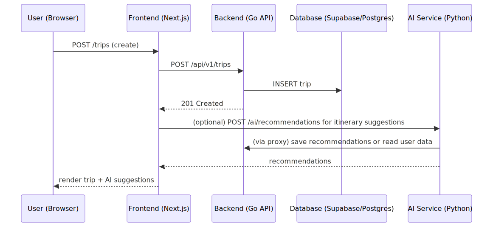

# Project Overview — TrailGuide AI

A concise guide to the repository structure, key files, and how the pieces connect.

---

## Architecture


### Quick flow (user creates a trip)



---

---

## Top-level files (what to open first)

- [README.md](../README.md) — project summary and developer notes.
- [vercel.json](../vercel.json) — frontend deployment config.
- [docker-compose.yml](../docker-compose.yml) — local composition for services.
- [package.json](../package.json) — frontend scripts and dependencies.
- [docs/env-vars.md](env-vars.md) — required environment variables.

---

## Frontend (`src/`)

- Entry: `src/app/layout.tsx`, `src/app/page.tsx` — application shell and main page.
- Routes: `src/app/(app)/` and other folders inside `src/app/` — route groups and pages.
- Components: `src/components/` — UI building blocks (calendar, photos, itinerary, etc.).
- Lib: `src/lib/ai.ts`, `src/lib/backend-proxy.ts` — helpers for AI and API calls.
- Public assets: `public/manifest.json`, `public/sw.js`, `public/icons/` — PWA and static files.

See `src/app/` and `src/components/` to explore UI features quickly.

---

## Backend (Go — `backend/`)

- Entry: `backend/main.go` — loads config, connects DB, registers routes.
- Config: `backend/config/config.go` — environment-driven settings.
- DB: `backend/db/db.go` — Postgres connection pool.
- Handlers: `backend/handlers/` — trip CRUD, AI proxy, health check (`trips.go`, `ai_proxy.go`, `health.go`).
- Middleware: `backend/middleware/auth.go` — Supabase JWT auth wrapper.

Notes:
- The backend hosts `/api/v1/*` routes and proxies AI-related endpoints to the Python service.
- Check `backend/main.go` to see route wiring and proxy usage.

---

## AI Microservice (Python FastAPI — `ai-service/`)

- Entry: `ai-service/main.py` — FastAPI app; routers mounted from `ai-service/middleware/routers/`.
- Routers: `chat.py`, `generate.py`, `recommendations.py`, `photos.py`, etc. — feature-specific AI endpoints.
- Services: `ai-service/services/` — clients for external APIs (e.g., Groq), helpers.
- Requirements: `ai-service/requirements.txt` — Python deps; Dockerfile present for containerized runs.

The Go backend typically proxies AI calls to the Python service (see `backend/handlers/ai_proxy.go`).

---

## Database & Migrations

- Migrations live in `supabase/migrations/` — review SQL files (`001_initial_schema.sql`, `002_phase4_columns.sql`, ...).
- The backend connects to Postgres/Supabase using `DATABASE_URL` from env (see `docs/env-vars.md`).

---

## Useful dev & run commands

From the repository root:

```bash
# Frontend (Next.js dev server)
npm run dev

# Backend (run from backend/)
cd backend
go run .

# AI service (run from ai-service/)
cd ai-service
pip install -r requirements.txt
uvicorn main:app --reload --host 0.0.0.0 --port 8000

# Using Docker Compose (local dev)
docker-compose up --build
```

Environment variables and secrets are documented in `docs/env-vars.md`.

---

## Where to look for details

- Frontend UI: `src/components/`, `src/app/`
- API surface: `backend/handlers/` and `ai-service/middleware/routers/`
- Auth and config: `backend/middleware/auth.go`, `backend/config/config.go`, `docs/env-vars.md`
- Migrations/schema: `supabase/migrations/`

---

## Next steps / Tips

- To explore features quickly: run the frontend (`npm run dev`) and open the network tab to inspect API calls.
- To trace AI behavior: run the AI service locally and hit `/health`, then send sample requests from the frontend.
- If you want, I can add a diagram mapping a specific feature (e.g., photo uploads, itinerary sync).

---

_Last updated: 2026-06-24_
