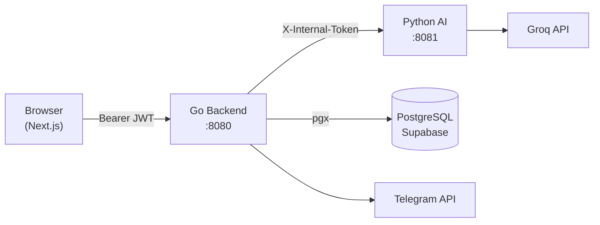
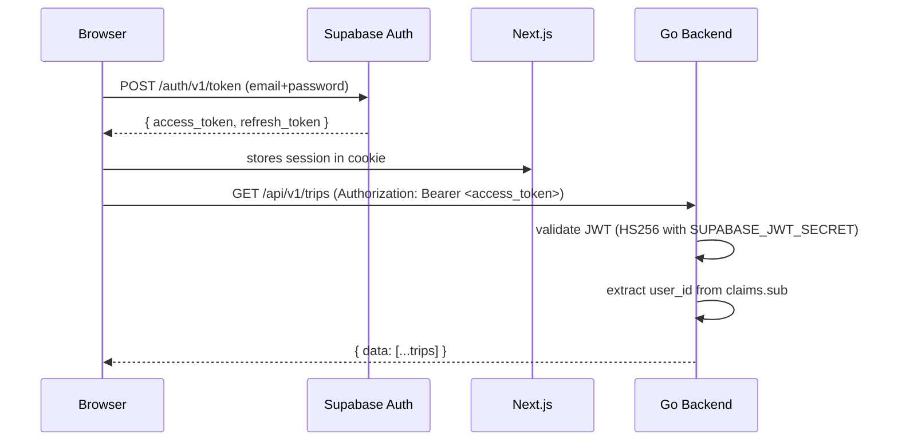
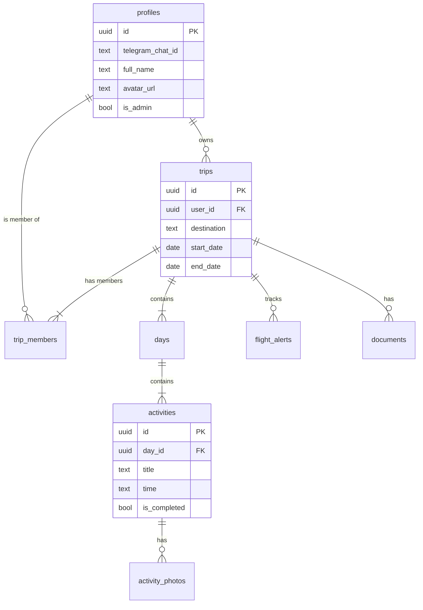

# TrailGuide AI — Phase 26: Agent-Friendly Codebase

> **For agentic workers:** REQUIRED SUB-SKILL: Use superpowers:subagent-driven-development (recommended) or superpowers:executing-plans to implement this plan task-by-task. Steps use checkbox (`- [ ]`) syntax for tracking.

**Goal:** Make every directory self-explanatory to a fresh AI agent. Add service-level `CLAUDE.md` / `AGENTS.md` files, Mermaid architecture diagrams, inter-service contract docs, and a symbol index so an agent can orient itself without reading every source file.

**Architecture:** Root `AGENTS.md` already exists but is minimal. Each service directory (`backend/`, `ai-service/`, `src/`) gets its own `AGENTS.md` explaining its responsibility, key files, how to run tests, and what NOT to touch. A new `docs/contracts/` folder documents every API boundary as a typed contract (Go struct ↔ Python Pydantic ↔ TypeScript interface). Mermaid diagrams live in `docs/diagrams/`.

**Tech Stack:** Markdown + Mermaid (rendered in GitHub/VS Code). No code changes to production services.

## Global Constraints
- Do NOT change any production code in this phase — docs only.
- Mermaid diagrams must render in GitHub markdown (use `\`\`\`mermaid` fences).
- Every new doc file must be committed with a meaningful path so it shows up in `git grep`.

---

## Task 1: Service-level AGENTS.md files

- [ ] **Step 1: Create `backend/AGENTS.md`**

```markdown
# Go Backend — Agent Guide

## What this service does
REST API for all data operations. Validates Supabase JWTs. Direct PostgreSQL via pgx.
Does NOT call Groq or external AI — forwards to Python AI service instead.

## Run
```bash
cd backend && go run main.go
# Requires: DATABASE_URL, SUPABASE_JWT_SECRET, AI_SERVICE_URL, INTERNAL_API_SECRET in .env
```

## Test
```bash
cd backend && go test ./...
```

## Key files
| File | Responsibility |
|---|---|
| `main.go` | Router wiring — add new routes here |
| `internal/config/config.go` | All env vars loaded here — add new ones here |
| `internal/middleware/auth.go` | JWT validation — DO NOT modify unless Supabase changes |
| `internal/handlers/*.go` | One file per resource (trips, days, activities, members…) |
| `internal/services/ai_client.go` | HTTP proxy to Python AI service |

## Adding a new route
1. Create handler in `internal/handlers/yourfeature.go`
2. Wire in `main.go` under the appropriate group (v1 = auth required, root = public)
3. Write test in `internal/handlers/yourfeature_test.go`

## DO NOT
- Store API keys in this service (Groq key lives in ai-service)
- Call Supabase REST API — use pgx directly
- Write to `profiles` without checking user ownership
```

- [ ] **Step 2: Create `ai-service/AGENTS.md`**

```markdown
# Python AI Service — Agent Guide

## What this service does
Pure AI/HTTP service. No database access. Called by the Go backend with X-Internal-Token header.
Handles: Groq LLM calls, Tavily web search, Wikipedia/Unsplash photo proxy, Open-Meteo weather.

## Run
```bash
cd ai-service && source .venv/bin/activate && uvicorn main:app --port 8081 --reload
# Requires: GROQ_API_KEY, TAVILY_API_KEY, UNSPLASH_ACCESS_KEY, INTERNAL_API_SECRET in .env
```

## Test
```bash
cd ai-service && pytest
```

## Key files
| File | Responsibility |
|---|---|
| `main.py` | FastAPI app + router registration |
| `middleware/auth.py` | X-Internal-Token check — applied to all AI routes |
| `services/groq_client.py` | Shared AsyncGroq singleton |
| `routers/*.py` | One file per route group |

## Adding a new AI route
1. Create `routers/yourroute.py` with a FastAPI router
2. Register in `main.py`: `app.include_router(yourroute.router)`
3. All routes under `/ai/` automatically get internal auth via the dependency

## Models
- Heavy tasks: `llama-3.3-70b-versatile` (max 8192 tokens)
- Fast tasks: `llama-3.1-8b-instant` (max 1024 tokens)
- Always strip markdown fences from Groq JSON responses

## DO NOT
- Access the database (no pgx, no Supabase client)
- Expose this service directly to the internet (Go proxies it)
- Cache results here — caching lives in Go/PostgreSQL
```

- [ ] **Step 3: Create `src/AGENTS.md`**

```markdown
# Next.js Frontend — Agent Guide

## What this service does
Pure frontend — NO backend logic. Auth via Supabase (session management only).
All data fetched from Go backend via `src/lib/api.ts`. No direct DB access.

## Run
```bash
export NVM_DIR="$HOME/.nvm" && \. "$NVM_DIR/nvm.sh" && npm run dev
# Requires: NEXT_PUBLIC_SUPABASE_URL, NEXT_PUBLIC_SUPABASE_ANON_KEY, NEXT_PUBLIC_API_URL in .env.local
```

## Test
```bash
npm run build   # type check + build
npx tsc --noEmit  # type check only
npx playwright test  # e2e tests (Phase 30)
```

## Key files
| File | Responsibility |
|---|---|
| `src/lib/api.ts` | ALL Go backend calls go through here — never use raw fetch to the Go backend |
| `src/lib/supabase/client.ts` | Supabase browser client — auth session only |
| `src/lib/supabase/server.ts` | Supabase server client — auth session only |
| `src/app/(auth)/` | Login/signup/callback — DO NOT move these |
| `src/app/(app)/` | All authenticated app pages |
| `src/middleware.ts` | Session refresh + auth redirect |

## Adding a new page
1. Create `src/app/(app)/yourpage/page.tsx` (server component — can be async)
2. Create `src/app/(app)/yourpage/YourClient.tsx` (client component with "use client")
3. Use `api.get()` / `api.post()` from `src/lib/api.ts` — never `fetch` directly to Go/Python

## DO NOT
- Add new API routes to `src/app/api/` — all routes live in Go or Python
- Import from `@supabase/supabase-js` directly — use `@/lib/supabase/client` or `@/lib/supabase/server`
- Use `supabase.from(...)` for data — use the Go backend API
- Add `GROQ_API_KEY` or backend secrets to Next.js env
```

- [ ] **Step 4: Commit**

```bash
git add backend/AGENTS.md ai-service/AGENTS.md src/AGENTS.md
git commit -m "docs: add service-level AGENTS.md files for AI agent orientation"
```

---

## Task 2: Architecture diagrams (Mermaid)

- [ ] **Step 1: Create `docs/diagrams/architecture.md`**

```markdown
# Architecture Diagrams

## Request Flow



## Auth Flow



## Database Tables


```

- [ ] **Step 2: Commit**

```bash
git add docs/diagrams/
git commit -m "docs: add Mermaid architecture, auth flow, and ER diagrams"
```

---

## Task 3: Inter-service contracts

- [ ] **Step 1: Create `docs/contracts/go-to-python.md`**

Document every route the Go backend calls on the Python AI service:

```markdown
# Go → Python AI Service Contracts

All requests include: `X-Internal-Token: <INTERNAL_API_SECRET>` header.
Base URL: `AI_SERVICE_URL` (default: http://localhost:8081)

## POST /ai/generate-itinerary
**Go calls:** `services/ai_client.go:ProxyToAI()`
**Request:** `{ destination, startDate, endDate, travelers, tripStyle, interests, transportMode, budget }`
**Response:** `{ days: [{ date, day_number, activities: [{ title, description, time, duration, cost, category, address, photo_query }] }] }`

## POST /ai/chat
**Response:** `text/plain` streaming — forward via `io.Copy()`

## POST /ai/recommendations
**Request:** `{ destination, interests, currentActivities }`
**Response:** `{ recommendations: [{ title, description, reason, category, address, estimated_cost, duration, photo_query }] }`

[... one section per route ...]
```

- [ ] **Step 2: Create `docs/contracts/frontend-to-go.md`**

Document the API surface that Next.js uses (mirrors the Go route table):

```markdown
# Frontend → Go Backend API Contracts

Base URL: `NEXT_PUBLIC_API_URL` (default: http://localhost:8080)
Auth: `Authorization: Bearer <supabase_access_token>` on all /api/v1/* routes.

## Trips
- `GET  /api/v1/trips` → `{ data: Trip[] }`
- `GET  /api/v1/trips/:id` → `{ data: Trip }`
- `POST /api/v1/trips` body: `Omit<Trip, 'id'|'user_id'|'created_at'>` → `{ data: { id: string } }`
- `DELETE /api/v1/trips/:id` → `{ data: { deleted: true } }`

## Days
- `GET  /api/v1/trips/:tripId/days` → `{ data: Day[] }` (includes nested activities)
- `POST /api/v1/trips/:tripId/days` body: `{ date, day_number }` → `{ data: { id } }`

[... one section per resource ...]
```

- [ ] **Step 3: Commit**

```bash
git add docs/contracts/
git commit -m "docs: add inter-service API contracts for Go→Python and Frontend→Go"
```

---

## Verification Checklist

- [ ] `backend/AGENTS.md` exists and describes how to add a new route
- [ ] `ai-service/AGENTS.md` exists and lists the correct Groq models
- [ ] `src/AGENTS.md` explains the api.ts pattern and warns against adding new API routes
- [ ] Mermaid diagrams render correctly on GitHub (test by viewing raw markdown)
- [ ] `docs/contracts/` files exist with at least 5 routes each documented
- [ ] `git grep "AGENTS.md"` returns files in all 3 service directories
